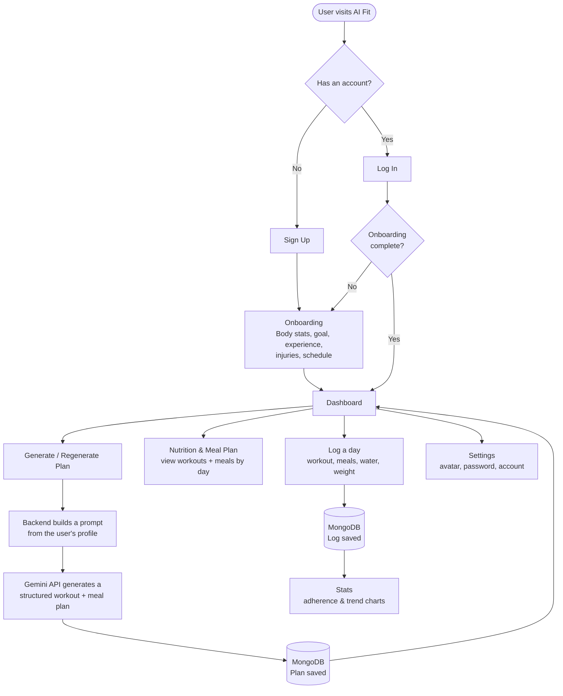

# AI Fit — AI Fitness & Nutrition Coach

AI Fit is a full-stack MERN web application that acts as a personal fitness and nutrition coach. Instead of a generic workout template, it asks each user about their body stats, experience level, goals, injuries, and available training days during onboarding, then uses Google's Gemini AI to generate a real, structured workout and meal plan built around that specific profile. Users can track daily adherence, watch their progress in charts, and regenerate a fresh plan any time their details change.

Built as a university capstone project.

---

## What it does

- **Personalized onboarding** — a short, guided flow collects gender, age, height, weight, experience level, goal (fat loss / muscle gain / strength / general fitness), injuries or conditions, available training days, and gym-vs-home preference.
- **AI-generated plans** — Gemini turns that profile into a structured workout + meal plan (exercises with sets/reps, meals with calories/protein/carbs/fats), covering one or more weeks, and can regenerate it whenever the user's details change.
- **Dashboard & tracking** — a home overview with today's key numbers (calories, protein, water, streak), a weekly activity chart, and daily reminders.
- **Nutrition & Meal Plan** — the full plan in one place: pick a day, see the workout and meals together with a macro breakdown.
- **Stats** — logs of daily adherence (workout done / meals followed / water / weight) turned into trend charts.
- **Account & Settings** — profile picture upload, editable body/preference details, change password, forgot-password email flow, and account deletion.

---

## Tech Stack

| Layer | Technology |
|---|---|
| Frontend | React (Vite), React Router, Tailwind CSS, Recharts |
| Backend | Node.js, Express |
| Database | MongoDB with Mongoose |
| Authentication | JWT (JSON Web Tokens), bcrypt password hashing |
| AI / Plan Generation | Google Gemini API (structured JSON output) |
| Email | Nodemailer (password reset) |

---

## How It Works



In short: the user's onboarding answers become the AI's instructions, Gemini returns a structured plan that gets stored in MongoDB, and everything the user does afterward — viewing the plan, logging a day, checking stats — reads from and writes back to that same data.

---

## Project Structure

```
Xebia-Capstone-Project/
├── backend/
│   ├── config/          # MongoDB connection
│   ├── controllers/      # Auth, user, plan, log business logic
│   ├── middleware/        # JWT auth guard
│   ├── models/            # User, Plan, Log (Mongoose schemas)
│   ├── routes/             # API endpoints
│   ├── utils/               # Email sending (Nodemailer)
│   └── server.js
└── frontend/
    ├── public/images/    # Local image assets
    └── src/
        ├── api/            # Axios client
        ├── components/      # Sidebar, layout, icons, header
        ├── context/          # Auth state, sidebar collapse state
        ├── pages/             # Landing, auth, onboarding, dashboard, etc.
        └── utils/              # Plan/date helper functions
```

---

## Getting Started

### 1. Backend
```bash
cd backend
npm install
cp .env.example .env   # fill in the values described below
npm run dev
```

Required environment variables (`backend/.env`):

| Variable | Purpose |
|---|---|
| `MONGO_URI` | MongoDB Atlas connection string ([free tier](https://www.mongodb.com/cloud/atlas)) |
| `JWT_SECRET` | Any long random string, used to sign auth tokens |
| `GEMINI_API_KEY` | Free key from [Google AI Studio](https://aistudio.google.com/app/apikey) |
| `EMAIL_USER` / `EMAIL_PASS` | Gmail address + [App Password](https://myaccount.google.com/apppasswords) for sending reset emails |
| `CLIENT_URL` | Frontend URL, e.g. `http://localhost:5173` |
| `PORT` | Backend port, e.g. `5000` |

### 2. Frontend
```bash
cd frontend
npm install
npm run dev
```
---

## Core Idea, In One Sentence

AI Fit turns a short onboarding questionnaire into a real, AI-generated fitness and nutrition plan, then helps the user actually stick to it by tracking what they log every day.
